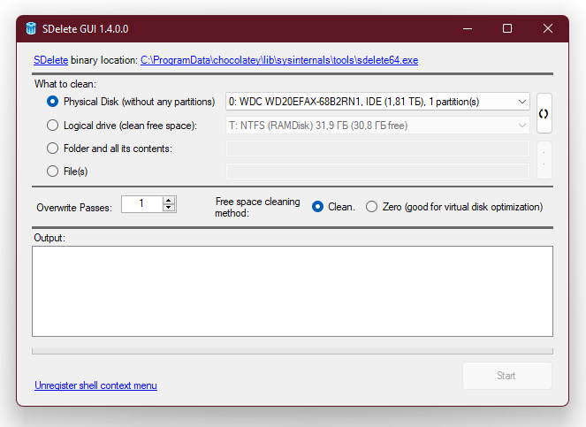
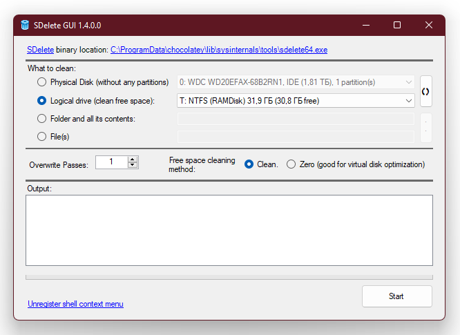
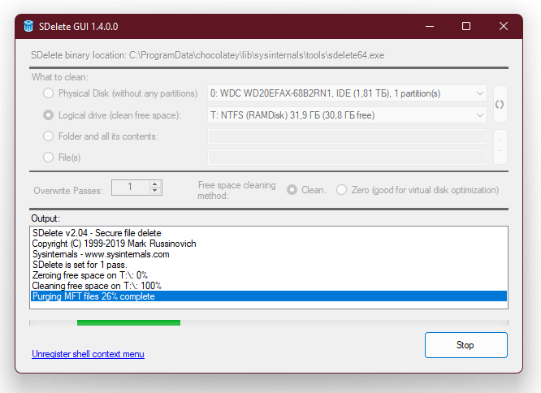
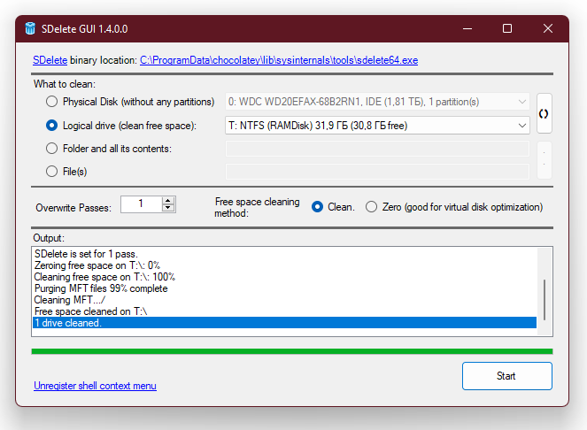

# SDeleteGUI
This is a simple GUI for a cool [SDelete (Secure file deleting) tool by Mark Russinovich (Sysinternals)](https://docs.microsoft.com/en-us/sysinternals/downloads/sdelete).

## How To Use:

You can specify the Disk Device (this disk must not contains any partitions!):

 Or Logical Disk (to clean free space on it):

 
 
  Or Folder or file(s).
  You must have the appropriate permissions to these files and folders in order to modify them. This program itself does not change the access level, but uses the current one.

 # Cleaning process:
 After selecting object to clean and clean method, click on Start button.
 This will start Sysinternals SDelete tool with selected parameners to process cleaning.

 In the Output section you will see the output data of the running SDelete tool.

## When the cleaning process is completed:
 And when the cleaning process is completed, you will see something like this:

 
It's just simple. Enjoy!
