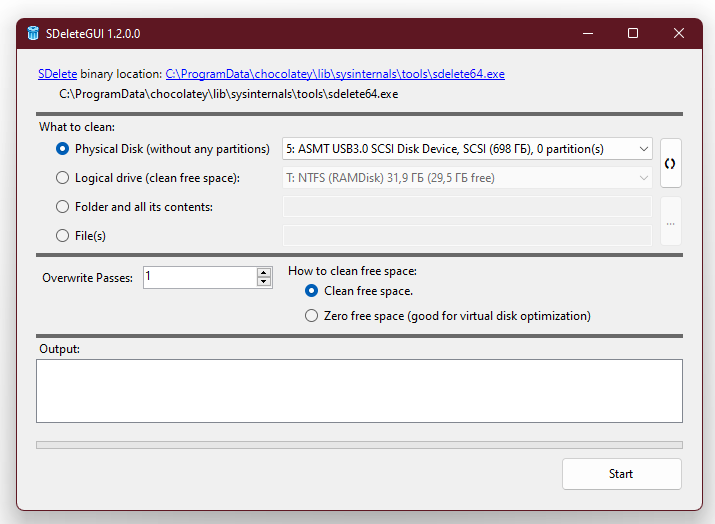

# SDeleteGUI
This is a simple GUI for a cool SDelete (Secure file deleting) tool made by Mark Russinovich (Sysinternals).
You can read more and download this tool from: https://docs.microsoft.com/en-us/sysinternals/downloads/sdelete

# Main Window

You can specify Disk Device or Logical Disk to clean, or select Directory or file(s)...
It's just simple.

Enjoy!
